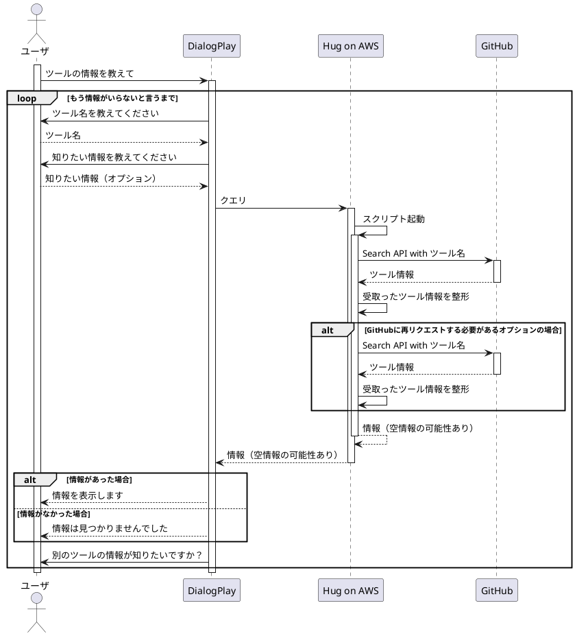

# TIS

Tool Information Searcher

ツールの情報を探索してくれるBotです。
プラットフォームはDialogPlayを利用しています。
決して某企業さんと関係があるわけではありません。

また、このリポジトリは任意のサーバにおいてください。
サーバには[HUG](https://github.com/timothycrosley/hug)を利用しています。


# Feature

APIサーバです。

任意のツール名とオプションを元に、欲しいツールの情報をGitHubから取得します。

全体の機能




# Commands

```bash:使い方
$ git clone https://github.com/Morichan/tis.git
$ cd tis
$ hug -f start_hug.py
```

